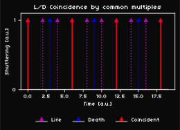

# Life–Death Zoetrope Hypothesis

## Abstract

We model “reality” as a continuous rotation (a phasor). What humans perceive as life and death are stroboscopic views through different slit tempos. The apparent direction and speed of time (forward / pause / reverse) emerge from aliasing between the world’s rotation and the observer’s sampling tempo, with tiny jitter producing boundary flips (“near-death” moments).

## Core

- **Origin World**: continuous rotation at angular speed $\omega_0$.
- **View**: equally spaced “zoetrope slits” at period $T$ (life: $T_L$, death: $T_D$).
- **Apparent time**: $\omega_{\text{app}}=\omega_0-k\,\Omega$, $\Omega=\tfrac{2\pi}{T}$, where $k$ is the nearest integer.  
  Sign($\omega_{\text{app}}$) ⇒ Forward / Pause / Reverse.

## Equations

- **Zoetrope slit (Dirac comb)**

  $`
  \mathrm{III}_T(t)=\sum_{n\in\mathbb{Z}}\delta(t-nT)
  `$

- **Apparent angular velocity (Forward / Pause / Reverse)**

  $`
  \omega_{\text{app}}=\omega_0-k\,\Omega,\quad \Omega=\tfrac{2\pi}{T}
  `$

  | Residual $\omega_{\text{app}}$ | Direction |
  | -----------------------------: | :-------- |
  |                           $>0$ | Forward   |
  |                           $=0$ | Pause     |
  |                           $<0$ | Reverse   |

- **Flicker (tempo jitter)**

  $`
  T(t)=T_0\,(1+\eta(t)),\ \ |\eta(t)|\ll 1
  `$

- **Coincident frames (life–death overlap)**  

  $nT_L = mT_D$  (rational ratio ⇒ periodic overlaps)

   

  

  

  *fig.1: Life/Death coincidence by common multiples*
  

